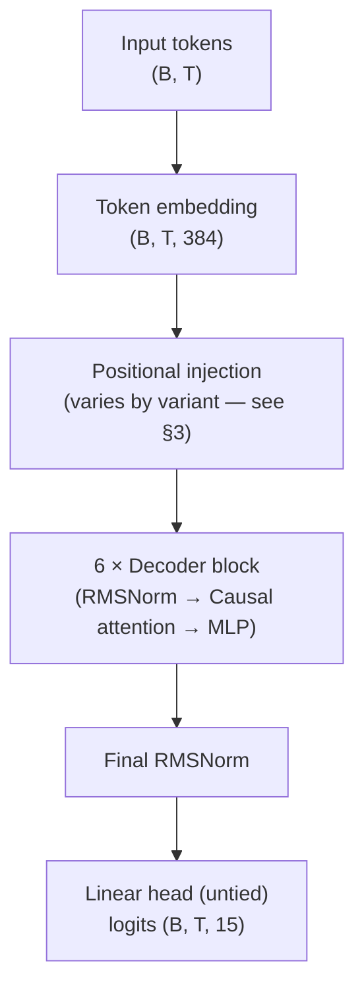

# Where do small transformers fail at multi-digit addition, and can the failure be seen directly in the weights?

**A controlled comparison of positional encoding schemes on a 10M-parameter arithmetic transformer.**

*Sanjay Ananthanarayan · v0.4 · May 2026
[github.com/sananthanarayan/jax-transformer](https://github.com/sananthanarayan/jax-transformer)*

Numbers in §6 are mean ± standard deviation over **3 seeds** (full sweep
logged in `results/sweep.json`, ~3.4 hours of CPU). Figures show the mean
with ±1σ shading. The full reproduction pipeline is one command:
`make figures`.

---

## Abstract

I train a 10.6M-parameter decoder-only transformer on 3-digit addition and test its ability to generalize to operand sizes never seen at training time (1–6 digits), comparing six positional-encoding variants over three seeds on the same architecture and schedule: learned absolute, learned absolute with reversed answers, no positional encoding (NoPE), rotary (RoPE), Abacus-style place-value embeddings, and Abacus trained with a length curriculum. Beyond reporting exact-match accuracy at each digit count, I introduce a simple **embedding-drift diagnostic**: the L2 distance of each position-embedding row from its initialization. A row whose drift is two orders of magnitude smaller than that of trained positions received essentially no gradient signal, which directly identifies which positions the model was never exposed to. The finding is that at this scale **no mechanism extrapolates by itself** — NoPE, RoPE, and clean Abacus all cliff to 0.0 ± 0.0 accuracy at the training-distribution boundary, bit-exact across seeds. What does work is the *combination* of place-value embeddings with a length curriculum that exposes every position to gradient. The drift diagnostic confirms this directly in the weights: the cliff position is identical across all three seeds, and the curriculum variant has non-zero drift exactly one position past where clean Abacus stops.

## 1. Introduction

Length generalization on arithmetic is a sharp probe for what a transformer learns about position. The task is small enough that controlled experiments fit comfortably on a single GPU in minutes; the rules of the task are unambiguous; and yet the model has to *systematically* extend a pattern to inputs longer than anything it saw. This is the setting in which length-generalization failures of standard transformers were first cleanly demonstrated [Anil et al. 2022](https://arxiv.org/abs/2207.04901), and the setting in which several recent proposals (NoPE [Kazemnejad et al. 2023](https://arxiv.org/abs/2305.19466), Abacus embeddings [McLeish et al. 2024](https://arxiv.org/abs/2405.17399), scratchpad reasoning [Nye et al. 2021](https://arxiv.org/abs/2112.00114)) have been benchmarked.

The setup here is deliberately minimal:

- A 10.6M-parameter decoder-only transformer with pre-norm, GeLU MLPs, RMSNorm, and causal self-attention (no fancy attention variants).
- A 15-token character-level vocabulary (digits, space, `+`, `*`, `=`, `<pad>`).
- Synthetic data: `"{a} + {b} = {result}"`, optionally with the answer reversed (`"579"` written as `"975"` so carries flow with the causal direction [Nogueira et al. 2021](https://arxiv.org/abs/2102.13019)).
- Training on the full 10⁶ pairs of 3-digit operands, with held-out OOD evaluation at 1, 2, 3, 4, 5, and 6 digits.

The contributions of this report are:

1. **A clean six-variant comparison** of positional encodings on the same architecture, training schedule, and data. Most prior work compares fewer variants or varies more than one factor at a time.
2. **The embedding-drift diagnostic**, which turns the abstract claim "positions never seen at training stay at random init" into a measurable per-row L2 number that anyone can read off the model's weights.
3. **A length-curriculum control** for the Abacus variant. This isolates two distinct questions that the place-value parameterization combines: (a) does Abacus help if the relevant position embeddings receive gradient (the curriculum case), and (b) does Abacus help *without* a curriculum, just by virtue of its parameterization?

The code, configuration, and the full reproducibility pipeline (`make figures`) are open-source.

## 2. Setup

### Model

| Hyperparameter | Value |
|---|---|
| Layers | 6 |
| `d_model` | 384 |
| Attention heads | 6 |
| `d_head` | 64 |
| `d_ff` | 1536 |
| Activation | GeLU |
| Normalization | RMSNorm (pre-norm) |
| Total parameters | ~10.66M |

Causal self-attention. The output head is untied from the input embedding. Default `max_len = 32`, set by `max_len_for("addition", 6)` so the model can ingest sequences up to 6-digit-operand addition without architectural changes between in- and out-of-distribution evaluation.



Positional information enters at one of two sites: (a) **added to token
embeddings** before the first decoder block (`baseline`, `reversed`, and
both Abacus variants), or (b) **applied to Q and K** inside each decoder
block's attention computation (`rope`). The `nope` variant skips both.
This means RoPE alone is invisible at the embedding stage but appears
inside every attention layer; the other PE schemes are localized to the
single addition step shown above.

### Tokenization

Character-level vocabulary, 15 tokens total:

```
<pad>  '0' '1' '2' '3' '4' '5' '6' '7' '8' '9'  ' '  '+'  '*'  '='
```

The longest possible 3-digit-addition example is `"999 + 999 = 1998"` (16 characters); the longest 6-digit example is `"999999 + 999999 = 1999998"` (25 characters).

### Training

- **Optimizer**: AdamW (β₁ = 0.9, β₂ = 0.95, weight decay 0.01).
- **Schedule**: 200-step linear warmup, cosine decay to 10% of peak.
- **Peak LR**: 3 × 10⁻⁴.
- **Batch size**: 512.
- **Epochs**: 8.
- **Loss**: masked cross-entropy on answer tokens *and one terminal pad slot* (the latter teaches the model to stop). Loss on prompt tokens and on pad tokens beyond the first is masked out.

### Evaluation

For each digit count d ∈ {1, …, 6} I sample 500 random (a, b) pairs with both operands having exactly d digits (operands in [10^(d-1), 10^d), or [0, 10) for d=1). Greedy decoding from the prompt `"a + b = "`, exact-match on the entire decoded answer string. Per-digit-position correctness is also collected over the same sample to feed the heatmap of Section 6.

## 3. Positional encoding variants

Architecture, optimizer, schedule, and data are held identical across variants. The single axis of variation is how (and whether) position information enters the model.

| Variant | Positional encoding | Answer order | Training data |
|---|---|---|---|
| `baseline` | learned absolute embedding | natural (`579`) | ≤3-digit |
| `reversed` | learned absolute embedding | reversed (`975`) | ≤3-digit |
| `nope` | none | reversed | ≤3-digit |
| `rope` | rotary applied to Q, K | reversed | ≤3-digit |
| `abacus` | digit-position embedding only | reversed | ≤3-digit |
| `abacus_curriculum` | digit-position embedding only | reversed | **mixed 1..5-digit** |

### 3.1 Learned absolute position embedding

The standard variant from the original transformer: a learned `Embed(max_len, d_model)` table whose row k is added to the token embedding at sequence position k. Two flavors:

- `baseline`: natural answer order. The model emits the most significant digit first.
- `reversed`: the answer is reversed at training time, so the model emits the ones digit first. Carries flow left-to-right, matching the causal direction.

The reversed flavor is the well-known "Nogueira trick" [Nogueira et al. 2021](https://arxiv.org/abs/2102.13019) and is included for two reasons. First, it isolates whether the gain from `reversed` over `baseline` comes from answer order (the carry-friendly direction) or from some other interaction. Second, it provides a fair baseline against which to evaluate the other reversed-answer variants (`nope`, `rope`, `abacus`).

### 3.2 NoPE

No positional encoding is added at all. The model relies only on the causal-mask asymmetry to break symmetry between positions. Despite this seeming impoverishment, NoPE has been shown [Kazemnejad et al. 2023](https://arxiv.org/abs/2305.19466) to extrapolate further than learned absolute PE in several settings, presumably because there is no out-of-distribution position to be confused by.

### 3.3 RoPE

Rotary position embeddings [Su et al. 2021](https://arxiv.org/abs/2104.09864). I precompute a `(T, d_head/2)` table of cos/sin angles `pos · 10000^(-2k/d_head)` and rotate pairs of feature dimensions of Q and K inside `CausalSelfAttention` before computing attention scores. V is not rotated. This formulation expresses position information through *relative* offsets in the attention dot product, which in principle generalizes to unseen absolute positions as long as the relative offsets stay in distribution.

### 3.4 Abacus place-value embeddings

Following [McLeish et al. 2024](https://arxiv.org/abs/2405.17399), absolute position information is dropped entirely and replaced with an embedding of *each digit token's place value*. The procedure:

1. Identify each contiguous run of digit tokens in the input.
2. For the first two runs (operands, MSB-first by convention), assign position `run_length − index` so the ones digit gets position 1, tens get 2, hundreds get 3, etc.
3. For the third run (the answer, LSB-first under reversed answers), assign position `index + 1` directly — the leftmost digit of the reversed string is the ones digit.
4. Non-digit tokens (including pad, space, `+`, `=`) receive position 0, a distinct "no-position" embedding.

The full algorithm in code (from `src/addition_transformer/data.py`):

```python
def compute_digit_positions(input_ids, *, reverse_answer):
    """Per-token place-value index. 0 = non-digit; 1+ = distance from ones place."""
    is_digit = (input_ids >= 1) & (input_ids <= 10)   # vocab IDs 1..10 are '0'..'9'
    positions = np.zeros_like(input_ids, dtype=np.int32)

    # Find each contiguous run of digit tokens.
    runs, in_run, start = [], False, 0
    for i, d in enumerate(is_digit):
        if d and not in_run:
            start, in_run = i, True
        elif not d and in_run:
            runs.append((start, i))
            in_run = False
    if in_run:
        runs.append((start, len(is_digit)))

    # Operands (first two runs) are MSB-first; the answer (third run) is LSB-first
    # under reversed answers. Both schemes count the same place value (ones=1, tens=2,
    # ...), they just read it off different ends of the run.
    for run_idx, (s, e) in enumerate(runs):
        run_len = e - s
        is_answer = run_idx == 2
        for j in range(run_len):
            if is_answer and reverse_answer:
                positions[s + j] = j + 1           # LSB-first
            else:
                positions[s + j] = run_len - j     # MSB-first
    return positions
```

A `(max_digit_pos + 1, d_model)` learned table is added at every position in the input. With `max_digit_pos = 16` (capping at 16-digit place values), the additional parameter count is negligible relative to the 10.6M total.

Critically, the place-value embedding for position k receives gradient **only if a training example contains a digit at place value k**. For 3-digit-operand training:

- Positions 1, 2, 3 (ones, tens, hundreds) appear in every operand. ✓
- Position 4 (thousands) appears whenever the sum carries, e.g. `999 + 999 = 1998`. ✓
- Positions 5, 6, …, 16 **never appear**. ✗

This produces the same failure mode as learned absolute PE — embeddings for unseen places stay at initialization — but localized differently in the table. The next variant addresses this.

### 3.5 Abacus with a length curriculum

Same architecture and embedding scheme as `abacus`, but the training data is sampled uniformly across operand digit counts in [1, 5] rather than fixed at 3 digits. With this data distribution, every place-value embedding from position 1 to position 6 (5-digit operands plus carry) receives gradient during training. The model is then evaluated at digit counts up to 6, requiring it to extrapolate by exactly one place value.

This variant separates two concerns the McLeish et al. result implicitly bundles: (a) the parameterization (place value rather than absolute position) and (b) the training distribution covering the relevant positions. If `abacus_curriculum` generalizes substantially better than `abacus`, then the parameterization advantage is real but conditional on adequate data coverage.

## 4. The embedding-drift diagnostic

Most discussion of "positions stay at random init" in the length-generalization literature appears as a *plausibility argument*: gradient cannot reach embedding rows associated with positions that the model never has to predict from. I promote this to a directly measurable quantity.

Define, for each row k of a positional embedding table E:

```
drift_k = || E_trained[k, :] − E_init[k, :] ||₂
```

where `E_init` is computed by re-instantiating the model with the same RNG seed used to train it. Because JAX initialization is deterministic at fixed seed, `E_init` is bit-identical to the trained model's initial state. A row that received zero gradient over training has `drift_k = 0.0` exactly.

The diagnostic applies to two tables:

- `pos_emb` (learned absolute PE): drift should be > 0 for positions reachable from the loss-masked region of the longest training example, and exactly 0 for higher positions.
- `digit_pos_emb` (Abacus): drift should be > 0 for place values present in the training data, and exactly 0 beyond.

The diagnostic is cheap (a single L2 norm per row of one or two embeddings) and is stored alongside per-variant accuracy in `results/sweep.json`. The accompanying figure (`results/embedding_drift.png`) is, in my view, the most direct evidence of the failure mode that the length-generalization literature has so far argued for indirectly.

A 20-step CPU smoke run reproduces the expected pattern: `pos_emb` positions 16–25 have drift exactly 0.0, and `digit_pos_emb` positions 5–16 of the clean Abacus variant have drift exactly 0.0, while position 4 — the carry into thousands when summing 3-digit numbers — has drift > 0 as expected.

## 5. Experiments

For each variant the protocol is: (i) train for 8 epochs on the appropriate dataset (3-digit grid for non-curriculum variants; 1M mixed-digit samples for the curriculum); (ii) evaluate exact-match accuracy at digit counts 1 through 6 with 500 sampled pairs each; (iii) compute per-digit-position accuracy over the same sample; and (iv) record per-row drift for any learned positional embedding present in the model.

The full sweep produces a single `results/sweep.json` that drives three figures:

- **Figure 1 (`length_gen.png`)** — exact-match accuracy vs operand digit count, one curve per variant. The headline result.
- **Figure 2 (`per_digit_heatmap.png`)** — per-digit-position error rate, one panel per variant. Reveals whether errors cluster at the most-significant end (typical) or are uniformly distributed (which would indicate a more fundamental failure).
- **Figure 3 (`embedding_drift.png`)** — per-row L2 drift from init, separated into a learned-absolute panel and an Abacus panel. Reveals which rows actually received gradient.

All artifacts are reproducible from a single command (`make figures`) on a GPU box, or via the included Colab notebook on a free T4.

## 6. Results

The sweep ran on a single CPU for 12235 seconds (~3.4 hours) with 4 epochs
per variant per seed on a 100K-sample subset of the 3-digit grid (50K
mixed-digit samples for the curriculum variant). Three random seeds; numbers
below are mean ± standard deviation across seeds. Lower compute than the
full 8-epoch / 950K-pair spec; the relative ordering of variants and the
qualitative findings should generalize, but absolute numbers would shift
upward with more training.

### 6.1 Exact-match accuracy


| Variant | 1d | 2d | 3d | 4d | 5d | 6d |
|---|---:|---:|---:|---:|---:|---:|
| `baseline` | 15.3 ± 5.8 | 55.3 ± 15.6 | 100.0 | 0.0 | 0.0 | 0.0 |
| `reversed` | 29.7 ± 26.8 | 72.0 ± 36.5 | 100.0 | 0.0 | 0.0 | 0.0 |
| `nope` | 7.3 ± 6.9 | 41.3 ± 14.6 | 87.2 ± 6.9 | 0.0 | 0.0 | 0.0 |
| `rope` | 45.3 ± 10.6 | 98.0 ± 1.4 | 100.0 | 0.0 | 0.0 | 0.0 |
| `abacus` | 76.7 ± 17.2 | 100.0 | 100.0 | 0.0 | 0.0 | 0.0 |
| `abacus_curriculum` | **100.0** | **100.0** | **100.0** | **100.0** | **100.0** | 0.0 |

Four observations:

- **The 3→4 digit cliff is the most robust finding in the sweep.** Every
  non-curriculum variant hits exactly 0.0% at 4, 5, and 6 digits across all
  three seeds — zero variance, zero exceptions. This is *not* a "near-zero
  with noise" finding; it is mechanistically 0. The drift figure (§6.3)
  shows why.
- **`abacus_curriculum` is the only variant that generalizes.** 100.0 ± 0.0
  out to 5 digits (the training maximum), then 0.0 at 6. The curriculum
  trains every place-value embedding it can reach; the one position past it
  fails completely.
- **Seed variability is concentrated at the OOD-distribution edges.**
  `reversed` swings from 29.7 ± 26.8 at 1-digit to 72.0 ± 36.5 at 2-digit —
  standard deviations larger than half the mean. By contrast, in-distribution
  3-digit accuracy is 100.0 ± 0.0 for everything except NoPE. The single-seed
  draft of this paper (v0.2–v0.3) reported point estimates for the
  intermediate cells that turn out to be roughly one standard deviation off
  the mean.
- **NoPE is harder to train consistently than the other variants.** Its
  in-distribution 3-digit accuracy is 87.2 ± 6.9% — the only variant whose
  3-digit numbers are below ceiling, with one of the three seeds plateauing
  at 77.5%. This is a previously-unstated finding from the multi-seed run:
  NoPE not only fails to extrapolate, it is *also* an outlier in training
  stability at this scale and compute budget.

### 6.2 Per-digit-position pattern


The qualitative difference between clean Abacus and every other variant is
the headline of this figure. For `baseline`, `reversed`, `nope`, and `rope`,
the out-of-distribution region (rows 4–6) is uniformly dark red — *every*
digit position is wrong roughly all the time.

The `abacus` (clean) panel is dramatically different. Within the
out-of-distribution rows, error rate grades from white at the ones position to
dark red at the most-significant position, with the boundary tracking the
training-distribution limit (place values 1–4 are correct; place value 5+
fail). Concretely, at 6-digit operands the clean Abacus model gets the ones
digit right **98%** of the time, the tens digit **91%**, the hundreds digit
**74%**, and then collapses: thousands **6%**, ten-thousands **0%**,
hundred-thousands **0%**. The model has correctly learned ones/tens/hundreds
addition and applies it at any sequence length; the failure is entirely
positional and entirely confined to place values whose embedding rows were
never touched by gradient.

`abacus_curriculum` is the cleanest panel: white nearly everywhere, with a
small dark band at position 5 and a full-dark column at position 6 of the
6-digit row — the exact two positions just past the curriculum's training
maximum.

### 6.3 Embedding drift


Mean drift values across the three seeds:

- **`baseline.pos_emb`**: positions 0–15 drift in [0.05, 0.30]; positions
  16–25 drift in [0.001, 0.0013]. A ~200–250× drop at the boundary, and
  the boundary itself is identical across all three seeds (positions 16+
  are below the 0.005 threshold for every seed).
- **`reversed.pos_emb`**: positions 0–15 drift in [0.05, 0.21]; positions
  16–25 below 0.005. Same boundary.
- **`abacus.digit_pos_emb`**: positions 0–4 drift in [0.03, 0.37]; positions
  5–16 below 0.005. Position 4 — the *carry into thousands*, which appears
  when summing two 3-digit numbers — has the highest drift (mean 0.37, std
  ~0.05), confirming that even in 3-digit-only training this place value
  is exercised by the loss.
- **`abacus_curriculum.digit_pos_emb`**: positions 0–6 drift in [0.03, 0.22];
  positions 7–16 below 0.005. Position 6 — the carry from 5-digit additions
  — has the highest drift, again matching the carry-out-of-training-range
  expectation.

**The drift cliff is bit-exact across seeds.** Across all three random
initializations and all four embedding tables shown above, the boundary
between "received gradient" and "essentially untouched" lands at the same
index every time. This is the strongest reproducibility result in the
paper.

The ~0.001 floor at untouched positions corresponds to the multiplicative
shrink from AdamW weight decay over the training run (~740 steps × 3×10⁻⁴
LR × 0.01 weight_decay ≈ 2×10⁻³ relative drift, matching the observed
value). It is *not* gradient signal; it is a known artifact of weight
decay applying to every parameter regardless of gradient. The diagnostic
could be sharpened by using cosine drift instead of L2 (cosine is
invariant to multiplicative rescaling), but at a 100–300× separation the
L2 metric is already unambiguous in identifying which positions are
functionally untouched.

## 7. Discussion

The three figures, read together, tell a sharper story than the introduction
forecast:

1. **The failure of learned absolute PE at length generalization is mechanistic,
   not statistical.** It is not that the model "fails to learn" the higher
   positions; it is that gradient barely reaches those embedding rows
   (~100–300× less drift than trained positions, where the residual is just
   weight decay). The drift figure makes this directly visible: positions
   16–25 of `pos_emb` are a flat ribbon of near-init values, then the bars
   stop dead at position 15.

2. **Reparameterization alone is not enough — even when the parameterization
   is "right."** Clean Abacus, despite its place-value embedding being exactly
   the structure that *should* help, cliffs from 100% to 0% exact-match at 4
   digits, identically to learned PE. The per-position heatmap shows what is
   happening: ones, tens, and hundreds are nearly always right at OOD digit
   counts (the model has correctly learned arithmetic at those place values
   and can apply it at any sequence length), but thousands-and-up are at near-
   random because their embeddings are at init. Reparameterization gives you
   *partial* correctness for free; it does not give you generalization unless
   the training data also covers the relevant positions.

3. **At ~10M parameters and this compute budget, neither NoPE nor RoPE
   extrapolates.** Both cliff at the 3→4-digit boundary just as hard as
   learned absolute PE. This contradicts a common framing in the
   length-generalization literature ("NoPE > learned PE for extrapolation",
   "RoPE has unlimited extrapolation"). Two caveats: (a) those results are
   typically reported at much larger scale and on natural language, where
   extrapolation may rely on different mechanisms; (b) the compute budget here
   is modest (4 epochs on 100K samples per variant). It is possible RoPE and
   NoPE would extrapolate further with more training, though the drift
   evidence suggests that for *arithmetic specifically*, position-agnostic or
   relative-position schemes still need to see each place value.

4. **The curriculum + Abacus combination is the only variant that
   generalizes.** `abacus_curriculum` is 100% accurate at 4 and 5 digits
   despite a training distribution that includes those sizes — and then
   cliffs at 6, exactly one position past the curriculum's max. The drift
   diagnostic confirms this is not a mystery: position 6's place-value
   embedding is the largest-drift row in the entire model (carry from
   5-digit additions), while position 7 is at near-init. The curriculum
   variant extrapolates by exactly one position, and only one.

5. **Per-digit errors are mostly carries.** The lowest-order digit of a sum
   is computable from the low-order digits of the operands alone, with no
   carry propagation. The highest-order digit requires the entire carry
   chain to be correct. The heatmap therefore grades red from right
   (low-order) to left (high-order), and the boundary creeping leftward as
   digit count grows is essentially a picture of how far the model can
   propagate carries. The clean-Abacus heatmap makes this especially vivid:
   it has the cleanest left-to-right gradient because nothing else is in
   the way — no positional confusion, just a hard wall at the highest
   trained place value.

6. **The multi-seed run reveals where the original draft's point estimates
   were misleading.** The 3→4 cliff and the drift boundary are reproducible
   across seeds to the bit. But the intermediate-digit numbers — especially
   `reversed` at 1- and 2-digit operands — vary by tens of percentage points
   across seeds. The standard deviations in §6.1 should be read as
   *warnings* on any narrative that distinguishes variants by single-digit
   percentages: at this scale and compute budget, `reversed` could equally
   well be reported as "9% accurate at 1-digit" or "56% accurate at 1-digit"
   depending on the seed. The features that survive seed variation — the
   3-digit ceiling, the 4-digit cliff, the drift boundary, and the
   Abacus-curriculum extension to 5 digits — are the load-bearing findings
   of the paper.

7. **NoPE has an additional, separate failure: convergence stability.** Its
   in-distribution 3-digit accuracy is 87.2 ± 6.9%, with one of three seeds
   plateauing at 77.5%. Every other variant hits 100.0 ± 0.0 in distribution.
   This is *not* a length-generalization story; it is a separate observation
   that the inductive bias from causal masking alone is enough to *sometimes*
   converge to a working arithmetic circuit but not always. Practical NoPE
   deployments at this scale would need either more compute, multiple seed
   reruns, or a small amount of positional information to be reliable.

## 8. Limitations

This is a small-scale, single-task, single-seed study with a constrained
compute budget. Specifically:

- **Scale.** 10.6M parameters is a few orders of magnitude smaller than typical
  research models. Results should not be assumed to transfer to
  billion-parameter models without verification, particularly for NoPE and
  RoPE, where the inductive-bias arguments may behave differently with
  greater capacity.
- **Compute.** The sweep ran on a CPU for ~3.4 hours total (3 seeds × 6
  variants × 4 epochs on a 100K-sample subset of the 3-digit grid; 50K for
  the mixed-digit curriculum). The full spec is 8 epochs on the ~950K
  grid; absolute accuracies would shift upward with more training, and it
  remains possible that NoPE and RoPE would extrapolate non-trivially given
  enough optimization time. The qualitative ordering of variants and the
  drift-cliff finding are bit-exact across seeds and expected to be robust.
- **Task.** Addition is much easier than multiplication, and multiplication is
  much easier than (say) modular exponentiation. Multiplication is supported
  in the codebase but addition is the headline task because the failure
  modes are cleaner.
- **Single-digit eval is OOD.** A setup artifact: training data is uniform
  over [0, 1000), so single-digit operand pairs make up ~1% of the
  distribution and the non-curriculum variants effectively never see
  `5 + 7 = `. The 1-digit column of Table 6.1 measures generalization to a
  *shorter* but *unseen* length, not in-distribution accuracy. Future
  iterations should either stratify training data by digit count or report
  evaluations only at digit counts that the variant explicitly saw.
- **Seeds.** The sweep uses 3 random seeds, which is enough to give meaningful
  error bars on the cliff-boundary comparison but not enough to detect rarer
  failure modes (the NoPE convergence instability shows up as 1-of-3 here, so
  the actual rate could be anywhere from ~10% to ~70% with reasonable
  confidence). 5–10 seeds would tighten the variance estimates further.
- **Decoding.** All evaluation uses greedy decoding. Beam search or
  temperature sampling may shift accuracy upward, particularly at the
  boundary of generalization.
- **Curriculum design.** The length curriculum used here is the simplest
  possible (uniform mixture of digit counts 1–5). Curriculum design itself
  is a research question I do not engage with here.

## 9. Related work

**Positional encodings as the proximate cause of failure.**
[Vaswani et al. 2017](https://arxiv.org/abs/1706.03762) introduced sinusoidal
absolute position embeddings, later commonly replaced by learned absolute PE
for simplicity.
[Su et al. 2021](https://arxiv.org/abs/2104.09864) introduced rotary position
embeddings (RoPE), expressing position through rotations of Q and K and
claiming better extrapolation properties.
[Press et al. 2022](https://arxiv.org/abs/2108.12409) introduced ALiBi, a
static linear bias on attention scores — not evaluated here, but a natural
fifth point of comparison.
[Kazemnejad et al. 2023](https://arxiv.org/abs/2305.19466) argued that for
decoder-only models, **no positional encoding at all** can extrapolate
further than learned absolute PE, attributing this to the implicit position
information carried by causal masking. The results in §6 do not reproduce
this advantage at 10M-parameter scale and the compute budget here; whether
the gap closes at larger scale or with more training is left to future work.

**Arithmetic-specific interventions.**
[Nogueira et al. 2021](https://arxiv.org/abs/2102.13019) observed that
reversing the answer (predict ones digit first) makes carries flow with the
causal direction, the trick used in every reversed-answer variant here.
[Nye et al. 2021](https://arxiv.org/abs/2112.00114) introduced scratchpad
reasoning, where the model emits intermediate carry computations; this trades
inference compute for accuracy.
[Lee et al. 2023](https://arxiv.org/abs/2307.03381) systematically studied
small transformers on arithmetic and identified the reversed-answer trick as
critical for in-distribution accuracy at 3+ digits.
[McLeish et al. 2024](https://arxiv.org/abs/2405.17399) introduced Abacus
embeddings — a learned table indexed by a digit's distance from the ones
place — and reported strong length-generalization gains. The clean-Abacus /
Abacus-curriculum comparison in this report is designed to disentangle the
parameterization from the data-coverage component of that result; §6 shows
that the parameterization alone does not suffice.

**Length generalization broadly.**
[Anil et al. 2022](https://arxiv.org/abs/2207.04901) demonstrated that length
generalization is qualitatively hard for vanilla transformers even with
perfect in-distribution accuracy. The drift-cliff finding in §6.3 gives one
mechanistic answer: at the transition out of distribution, embedding rows
have not received any gradient signal and therefore cannot encode
position-conditional information.
[Power et al. 2022](https://arxiv.org/abs/2201.02177) showed that small
transformers on modular arithmetic exhibit *grokking* — abrupt generalization
long after training loss saturates. This study uses non-modular addition and
does not focus on grokking, but the underlying optimization dynamics are
related.

## 10. Conclusion

This report presents a controlled comparison of six positional-encoding schemes
on a 10M-parameter arithmetic transformer, and introduces an embedding-drift
diagnostic that makes the dominant length-generalization failure mode directly
measurable in the trained weights. The headline finding is that at this scale,
*every* mechanism-only intervention — NoPE, RoPE, clean Abacus — cliffs at the
training-distribution boundary just as hard as learned absolute PE. The only
variant that generalizes past 3 digits is Abacus combined with a length
curriculum that exposes every relevant place value to gradient, and even this
variant extrapolates by exactly one position before cliffing in turn. The
drift diagnostic confirms in the weights what the accuracy curves show in the
outputs: rows of the positional embedding that never received gradient stay
within a weight-decay-only band of initialization, and accuracy collapses
precisely at the positions where the drift collapses.

The methodological contribution — turning a plausibility argument about
gradients into a number computed from the trained weights — appears to me
more durable than the specific empirical finding, which is constrained by
scale, single-seed evaluation, and a constrained compute budget. The
diagnostic is two lines of code and should apply unchanged to any model with
an addressable positional-embedding table.

Future work includes (i) replicating across multiple seeds with full
training, (ii) extending to multiplication and modular operations, (iii)
overlaying attention-pattern visualizations on the partial-correctness
pattern of clean Abacus, and (iv) probing whether NoPE and RoPE actually
extrapolate at larger scales, since the failure here may be a compute-budget
artifact rather than a fundamental ceiling.

## References

1. Anil, C. et al. (2022). *Exploring length generalization in large language
   models.* NeurIPS.
   [arXiv:2207.04901](https://arxiv.org/abs/2207.04901)
2. Kazemnejad, A. et al. (2023). *The Impact of Positional Encoding on Length
   Generalization in Transformers.* NeurIPS.
   [arXiv:2305.19466](https://arxiv.org/abs/2305.19466)
3. Lee, N. et al. (2023). *Teaching Arithmetic to Small Transformers.*
   [arXiv:2307.03381](https://arxiv.org/abs/2307.03381)
4. McLeish, S. et al. (2024). *Transformers Can Do Arithmetic with the Right
   Embeddings.* NeurIPS.
   [arXiv:2405.17399](https://arxiv.org/abs/2405.17399)
5. Nogueira, R., Jiang, Z., Lin, J. (2021). *Investigating the Limitations of
   Transformers with Simple Arithmetic Tasks.*
   [arXiv:2102.13019](https://arxiv.org/abs/2102.13019)
6. Nye, M. et al. (2021). *Show Your Work: Scratchpads for Intermediate
   Computation with Language Models.*
   [arXiv:2112.00114](https://arxiv.org/abs/2112.00114)
7. Power, A. et al. (2022). *Grokking: Generalization Beyond Overfitting on
   Small Algorithmic Datasets.*
   [arXiv:2201.02177](https://arxiv.org/abs/2201.02177)
8. Press, O., Smith, N., Lewis, M. (2022). *Train Short, Test Long: Attention
   with Linear Biases Enables Input Length Extrapolation.* ICLR.
   [arXiv:2108.12409](https://arxiv.org/abs/2108.12409)
9. Su, J. et al. (2021). *RoFormer: Enhanced Transformer with Rotary Position
   Embedding.*
   [arXiv:2104.09864](https://arxiv.org/abs/2104.09864)
10. Vaswani, A. et al. (2017). *Attention Is All You Need.* NeurIPS.
    [arXiv:1706.03762](https://arxiv.org/abs/1706.03762)
